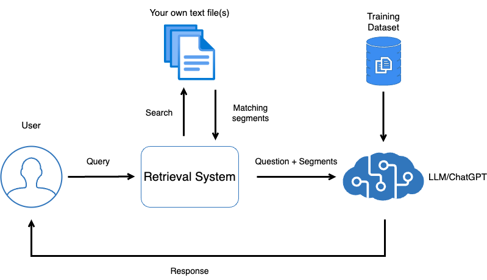
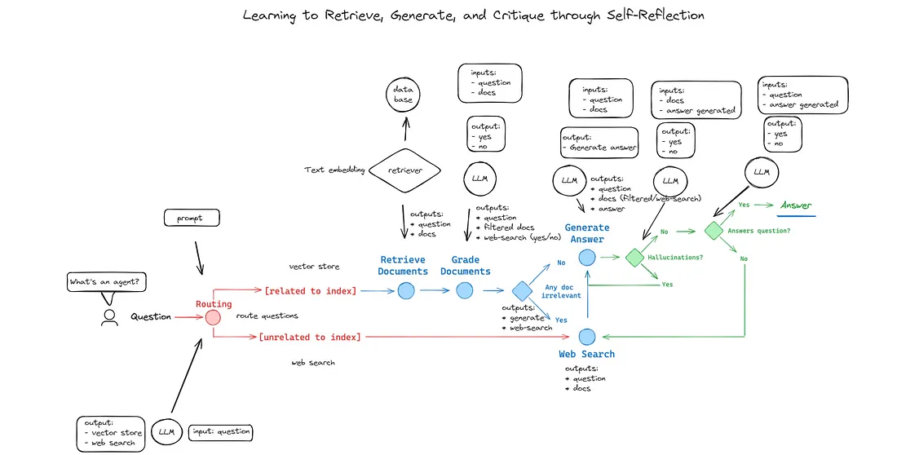

# Чат-бот РУДН на основе языковой модели GigaChat и RAG

Росcийский университет дружбы народов (РУДН) — это международный университет, объединяющий студентов и специалистов из множества стран мира. Мы стремимся продемонстрировать технологические возможности РУДН и облегчить для будущих студентов процесс погружения в учебные процессы. Для этого мы разработали интеллектуального помощника на основе искусственного интеллекта, который поможет новым студентам быстро находить ответы на интересующие их вопросы и адаптироваться к жизни в университете.

## RAG система

В проекте используется `RAG (Retrieval-Augmented Generation)` — подход, который сочетает поиск информации и генерацию ответов.



Это пример простой RAG системы для задач вопроса-ответной формы. Однако эта модель не умела вещей, которые для нас были важны:

1. Помнить контекст
2. Давать релевантный ответ на вопрос, которого нет в базе данных
3. Не отвечать на вопросы не связанные с РУДН

И для реализации вышеперечисленных пунктов мы использовали усовершенствованную RAG систему

## RAG система с агентами



### **1. Routing (Агент релевантности запроса)**

В проекте используется агент релевантности, который классифицирует вопросы, связанные с РУДН, и отсекает нерелевантные запросы. Если вопрос относится к университету, он передаётся на следующую стадию обработки. Если нет — помощник должен сгенерировать вежливый ответ: "Извините, я отвечаю только на вопросы, связанные с РУДН. 
[src/graph/chains/router.py](https://github.com/mklyazhev/rudn_rag/blob/readme_branch/src/graph/chains/router.py)

### 2. Retriever Node (Поиск по базе)

В системе RAG Retriever Node отвечает за поиск релевантной информации в базе данных, обеспечивая основу для точных ответов. Когда пользователь задаёт вопрос, Retriever Node просматривает документы и выбирает наиболее подходящие фрагменты. Эти данные затем передаются генератору, который на их основе формирует более точный ответ.
[src/graph/nodes/retrieve.py](https://github.com/mklyazhev/rudn_rag/blob/readme_branch/src/graph/chains/router.py)

### 3. Grading Documents Node (Оценка релевантности документов)

Компонент Grading Documents Node оценивает релевантность найденных документов, определяя, насколько каждый из них соответствует запросу пользователя. Он присваивает документам оценки, отражающие их полезность и точность для данного запроса. Этот процесс помогает выбрать наиболее ценные источники для формирования финального ответа, улучшая качество и точность выдачи информации.
[src/graph/nodes/grade.py](https://github.com/mklyazhev/rudn_rag/blob/readme_branch/src/graph/nodes/grade.py)

### 4. Web Search (Поиск в интернете)

Компонент Web Search используется для расширения объёма информации, доступной системе, за счёт поиска данных в интернете. Если внутренние базы данных не содержат нужной информации для ответа, система инициирует веб-поиск, чтобы получить дополнительные релевантные сведения. Это позволяет помощнику предоставлять более полные и актуальные ответы, особенно для запросов, требующих внешних данных.
[src/graph/nodes/web_search.py](https://github.com/mklyazhev/rudn_rag/blob/readme_branch/src/graph/nodes/web_search.py)

### 5. Generating Answers Node (Генерация сообщения)

Компонент Generating Answers Node отвечает за создание финального ответа на основе информации, полученной от других узлов системы. Используя найденные данные, он формирует связный и точный ответ, максимально соответствующий запросу пользователя. Этот узел применяет алгоритмы генерации текста, адаптируя информацию в удобной и понятной форме.
[src/graph/nodes/generate.py](https://github.com/mklyazhev/rudn_rag/blob/readme_branch/src/graph/nodes/generate.py)

### 6. Self-Check Mechanism (Проверка на галлюцинации)

Механизм самокоррекции отвечает за проверку точности сгенерированного ответа, выявляя возможные галлюцинации — то есть неточные или бессмысленные сведения.

- **Отсутствие галлюцинаций:** Если ответ признан корректным, он проходит на следующую стадию проверки.
- **Обнаружение галлюцинаций:** При выявлении неточностей система возвращается к Generating Answers Node, чтобы переформировать ответ и улучшить его точность.

Этот механизм повышает надёжность системы, гарантируя, что пользователи получают достоверную информацию.

[src/graph/chains/hallucination_grader.py](https://github.com/mklyazhev/rudn_rag/blob/readme_branch/src/graph/chains/hallucination_grader.py)

### 7. Validating the Final Answer (Валидация финального ответа)

На этапе валидации финального ответа система проверяет, соответствует ли он заданному вопросу.

- **Да:** Если ответ правильно отвечает на вопрос, он предоставляется пользователю.
- **Нет:** Если ответ недостаточен или неполон, система инициирует веб-поиск для получения дополнительной информации.

[src/graph/chains/answer_grader.py](https://github.com/mklyazhev/rudn_rag/blob/readme_branch/src/graph/chains/answer_grader.py)

## **Как это установить и запустить**

### Установка

Этот код написан на Python 3.10 и требует установки пакетов, перечисленных в файле [requirements.txt](https://github.com/mklyazhev/rudn_rag/blob/readme_branch/requirements.txt)

Используйте следующую команду, чтобы клонировать репозиторий на свой локальный компьютер:

```
git clone https://github.com/mklyazhev/rudn_rag.git
```

В файле [.env.dist](https://github.com/mklyazhev/rudn_rag/blob/readme_branch/.env.dist) передайте ключ от GigaChat и токен телеграмм бота, а также путь к базе данных RAG

### Запуск

 ```
python main.py
```


